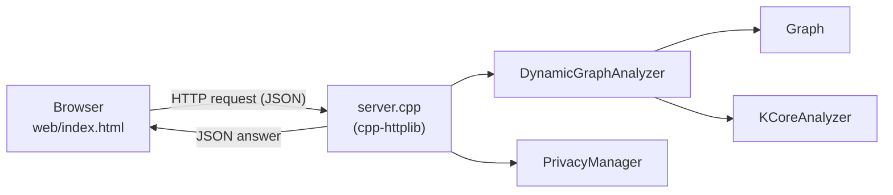
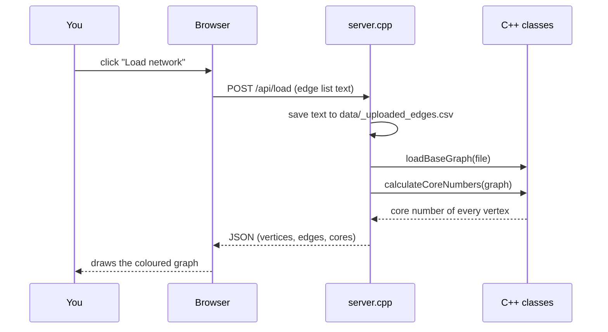

# Privacy-Aware Dynamic K-Core Analyzer

A C++ project that finds the **k-core structure** of a graph, keeps it up to date as edges are **added and removed**, and reports results with **differential privacy** (Laplace noise). It now comes with a **web interface** that runs on top of the C++ code, so you can explore everything in the browser without touching the console menu.


▶ [Watch the full walkthrough video (MP4, about 1 minute)](docs/demo.mp4)

<!-- Live demo link (add your Vercel URL here) -->

---

## What it does

| Feature | Description |
|---|---|
| **Load a network** | Reads an edge list (`u v` per line, tab or comma separated). |
| **K-core decomposition** | Computes the core number of every vertex with the standard peeling algorithm, and the size of every k-core. |
| **Dynamic updates** | Add or remove single edges, or process a whole stream of `ADD` / `REMOVE` updates in batches. A **snapshot** (vertices, edges, 3-core size, 5-core size, max core, runtime) is taken after each batch. |
| **Privacy analysis** | Releases the 3-core size with Laplace noise for a chosen privacy budget ε, and checks the noise generator against theory. |
| **Exact vs private comparison** | Shows how the error grows as ε shrinks (ε = 0.5, 1, 2, 5). |
| **CSV export** | Saves all snapshots to `results/dynamic_results.csv`. |

---

## Screenshots

*Captured from the browser interface. The page backed by the C++ server looks the same and additionally shows a green "connected to C++ server" line under the title.*

### Network overview
Vertices are coloured by core number (blue = low, red = high). The slider fades out everything below the chosen k, so the inner cores stand out.


### K-core analysis
Size of every k-core and the degree and core number of each vertex.


### Dynamic update stream
Each batch of updates produces a snapshot. The chart tracks how the 3-core, 5-core and maximum core change over time.


### Privacy analysis
Checks 10,000 Laplace samples against the theoretical mean and variance, then releases the 3-core size with noise.


### Exact vs private comparison
Smaller ε means stronger privacy and a larger expected error.


### Dark theme
The interface follows your system's light or dark setting.


---

## How it works

The browser never calculates anything itself. It sends a request to a small web server (`server.cpp`), which calls the existing C++ classes and sends the answer back as JSON. The page only draws what it receives.



For example, clicking **Load network**:



`server.cpp` does not modify any of the original files. It only `#include`s them and calls their functions, so any change you make to the C++ shows up in the web page after you rebuild.

### API

| Method | Endpoint | What it does |
|---|---|---|
| GET | `/api/state` | Current graph, core numbers and statistics |
| POST | `/api/load` | Load a network (body = edge list) |
| POST | `/api/edge?action=ADD\|REMOVE&u=1&v=2` | Add or remove one edge |
| POST | `/api/stream?batch=3` | Process an update stream (body = update lines) |
| GET | `/api/export` | Write `results/dynamic_results.csv` and return it |
| GET | `/api/privacy?eps=1` | Noise validation plus exact and private 3-core size |
| GET | `/api/compare` | Exact vs private 3-core size for ε = 0.5, 1, 2, 5 |

---

## The key ideas, with code

### 1. K-core peeling (`kcore.cpp`)

A vertex's **core number** is the largest k for which it belongs to a subgraph where every vertex has at least k neighbours. The algorithm repeatedly removes ("peels") vertices whose remaining degree is at most the current k, and assigns them core number k. Removing a vertex lowers its neighbours' degrees, which may push them below k too.

```cpp
while (processed_count < total_vertices) {
    // Enqueue all remaining vertices with current degree <= current_k
    for (int v : vertices) {
        if (core_numbers.find(v) == core_numbers.end() && degrees[v] <= current_k) {
            process_queue.push(v);
            core_numbers[v] = current_k;
        }
    }
    if (process_queue.empty()) { current_k++; continue; }

    // Peel vertices and update effective degrees of neighbours
    while (!process_queue.empty()) {
        int u = process_queue.front(); process_queue.pop();
        processed_count++;
        for (int neighbor : graph.getNeighbors(u)) {
            if (core_numbers.find(neighbor) == core_numbers.end()) {
                degrees[neighbor]--;
                if (degrees[neighbor] <= current_k) {
                    process_queue.push(neighbor);
                    core_numbers[neighbor] = current_k;
                }
            }
        }
    }
    current_k++;
}
```

### 2. Dynamic updates and snapshots

Updates are applied to the live graph one at a time. After every *batch* of updates the analyzer recomputes the cores and records a snapshot, which is what the table and chart on the **Updates** tab show.

### 3. Privacy: the Laplace mechanism

Releasing the exact size of the 3-core could reveal whether one particular edge exists. To prevent that, noise drawn from a Laplace distribution is added:

```
private_value = exact_value + Laplace(scale = sensitivity / ε)
```

Here the sensitivity is 1, so the noise scale is `b = 1/ε`. The noise has mean 0 and variance `2b²`. A **smaller ε gives stronger privacy but more noise**. The *Privacy* tab draws 10,000 samples and compares their mean and variance with these theoretical values.

### 4. The web server (`server.cpp`)

Each endpoint is a few lines that call the existing classes. This one loads a network:

```cpp
svr.Post("/api/load", [](const httplib::Request& req, httplib::Response& res) {
    lock_guard<mutex> lk(mtx);
    writeFile(EDGES_TMP, req.body);              // loadBaseGraph() expects a filename
    analyzer.reset(new DynamicGraphAnalyzer());  // fresh, empty analyzer
    if (!analyzer->loadBaseGraph(EDGES_TMP) || analyzer->getGraph().vertexCount() == 0)
        return fail(res, "Failed to load graph (no valid edges found).");
    snapshots.clear();
    snapshots.push_back(analyzer->captureSnapshot("T0 (Base)"));
    res.set_content(stateJson(), "application/json");   // graph + core numbers
});
```

### 5. The web page (`web/index.html`)

The page asks the server and draws the reply:

```js
async function api(path, method = 'GET', body) {
  const r = await fetch(path, { method, body, headers: body ? { 'Content-Type': 'text/plain' } : {} });
  const t = await r.text();
  if (!r.ok) throw new Error(t || ('HTTP ' + r.status));
  return JSON.parse(t);
}

$('load').onclick = () => run(async () => {
  const st = await api('/api/load', 'POST', $('edges').value);  // the C++ code does the work
  apply(st, true);                                              // draw what came back
});
```

---

## Sample data

The included dataset has **40 vertices and 108 edges** arranged as five dense groups, a few bridges between them and a sparse outer layer, so the core levels range from 1 to 7. Your original 10 edges are part of it.

| k | Vertices in the k-core |
|---|---|
| 1 | 40 |
| 2 | 40 |
| 3 | 36 |
| 4 | 26 |
| 5 | 14 |
| 6 | 8 |
| 7 | 8 |

`data/updates.csv` holds 15 updates. Processed in batches of 3 they give these snapshots:

| Time | Vertices | Edges | 3-Core | 5-Core | Max Core |
|---|---|---|---|---|---|
| T0 (Base) | 40 | 108 | 36 | 14 | 7 |
| T1 | 40 | 109 | 37 | 14 | 6 |
| T2 | 40 | 108 | 37 | 14 | 6 |
| T3 | 40 | 109 | 37 | 14 | 6 |
| T4 | 40 | 110 | 37 | 14 | 6 |
| T5 | 40 | 113 | 38 | 14 | 6 |

**File formats**

```
data/sample edges.csv        data/updates.csv
1	2                        ADD	1	5
1	3                        REMOVE	2	4
...                          ...
```

Edges are `u v` with a tab (a comma also works in the web page). Updates are `ADD u v` or `REMOVE u v`.

---

## Project structure

```
.
├── main.cpp               console menu program (original)
├── graph.h / graph.cpp    undirected graph (adjacency lists)
├── kcore.h / kcore.cpp    k-core peeling algorithm
├── DynamicGraph.h / .cpp  updates, snapshots, CSV export
├── PrivacyManager.h / .cpp  Laplace noise and privatization
├── server.cpp             web server that exposes the classes above
├── httplib.h              cpp-httplib (single-header HTTP library, MIT licence)
├── web/index.html         the web interface (talks to server.cpp)
├── vercel-site/index.html standalone copy that runs without a server (for hosting)
├── data/                  edge list and update stream
├── results/               exported CSV files
├── docs/                  screenshots and demo video
├── build.bat              compiles server.exe (Windows)
└── run.bat                starts the server and opens the browser (Windows)
```

---

## Running it

### Web interface (Windows)

1. **Build once** (and again after you change any C++ file): double-click `build.bat`, or run

   ```
   g++ -std=c++17 -DNOMINMAX -D_WIN32_WINNT=0x0A00 server.cpp DynamicGraph.cpp kcore.cpp graph.cpp PrivacyManager.cpp -o server.exe -lws2_32
   ```

2. **Run**: double-click `run.bat`. The server starts and your browser opens `http://localhost:8080`. Keep the black server window open while you use the page.
3. Click **Load network**, then explore the tabs.

Run `server.exe` from the project folder so it can find `data/` and `results/`.

On Linux or macOS the same sources should build with `g++ -std=c++17 server.cpp DynamicGraph.cpp kcore.cpp graph.cpp PrivacyManager.cpp -o server -pthread`, but this has not been tested.

### Console version

```
g++ -std=c++17 main.cpp DynamicGraph.cpp kcore.cpp graph.cpp PrivacyManager.cpp -o analyzer
./analyzer
```

### Standalone page (no C++, no server)

Open `vercel-site/index.html` in a browser, or deploy that folder to any static host such as Vercel. It reimplements the same algorithms in JavaScript, so it is handy for demos, but it is **not** connected to the C++ code.

---

## Good to know

- The server keeps **one graph in memory**, so it is meant for a single user on your own machine.
- **Process stream** applies updates to the graph that is currently loaded, just like the console menu. Click **Load network** first to start again from the base graph.
- Private results use fresh random noise on every run, so they differ each time. The exact results are deterministic.
- The server writes two temporary files, `data/_uploaded_edges.csv` and `data/_uploaded_updates.csv`, because `loadBaseGraph()` and `processUpdateStream()` take file names. They are overwritten on each use and are safe to delete.
